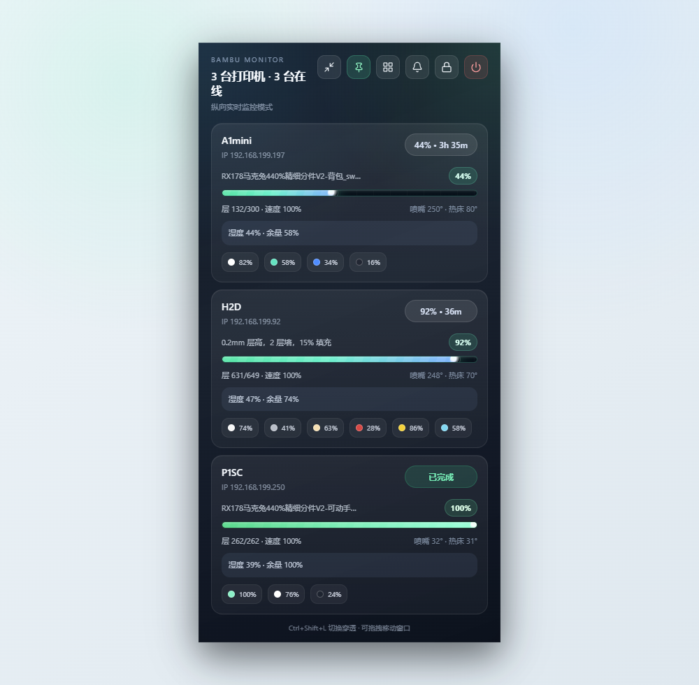
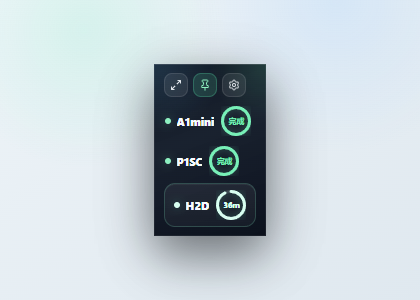

# BambuMonitor

BambuMonitor 是一款面向 Bambu Lab / 拓竹打印机的 Windows 桌面悬浮监控工具。它会登录拓竹账号读取已绑定设备，在局域网内发现可连接的打印机，并通过本地 MQTT 显示实时打印进度、剩余时间、温度、AMS 和异常状态。

它不是切片软件，也不会替代 Bambu Studio；它更像一个常驻桌面的轻量监控面板，适合多台机器同时打印时快速查看状态。

## 截图






## 下载安装

Windows 安装包在 GitHub Release 中提供：

[前往 Releases 下载](https://github.com/wuji419-bit/BambuMonitor/releases)

源码仓库不会提交 `release/`、`dist/`、`node_modules/` 或本地调试文件。

## 功能

- 多台 Bambu Lab / 拓竹打印机同时监控
- 完整模式、紧凑模式和超迷你模式
- 窗口置顶、鼠标穿透锁定和透明度调节
- 账号密码登录和验证码登录
- 自动局域网扫描，扫不到时可手动设置 IP
- 实时显示进度、剩余时间、层数、温度、风扇、速度和 AMS 信息
- 局域网实时模式会按本地遥测时间继续倒计时，避免剩余时间长时间停留在旧值
- Windows 托盘菜单：显示/隐藏、锁定、布局切换、透明度调节和退出
- OpenClaw、Hermes 或其他 Webhook 自动化通知

## 重要说明：以局域网实时数据为准

BambuMonitor 的主要定位是“局域网实时监控”。真正准确的进度、剩余时间、温度、AMS、层数和异常状态，来自当前电脑直连打印机本地 MQTT 服务。

外网或云端概览模式只作为兜底显示：它能帮助你看到设备是否在线、云端返回的粗略打印状态，但这些信息可能延迟、不完整，甚至和现场实际状态不一致。请不要把远程/云端概览当成拓竹官方 App 那种完整远程实时监控。

如果需要拓竹官方远程视图、云端远程控制或官方插件能力，请使用 Bambu Connect、Bambu Studio 或 Bambu Handy。本项目不会打包或读取 Bambu networking plugin 的私有数据，只在界面中提示用户使用官方工具。

## 关于外网连接

当前完整实时进度来自打印机本地 MQTT 服务，应用需要能从当前电脑访问到打印机的 `8883` 端口。人在外面时，普通公网环境不能直接连家里/工作室的局域网打印机；应用会先进入“云端概览模式”，显示云端在线/打印状态，并提示该模式不包含温度、AMS、层数和精确实时进度。

如果需要完整实时监控，建议先用 Tailscale、ZeroTier、WireGuard 或路由器 VPN 连回同一网络，再在应用里填写这个隧道里可访问的打印机 IP。登录拓竹账号只用于同步绑定设备和访问码，不等于接入拓竹官方 App 的远程实时通道。

## 快捷键

- `Ctrl + Shift + L`：锁定/解锁鼠标穿透
- `Ctrl + Shift + H`：切换横向/纵向布局

## 技术栈

- Electron 40
- React 19
- Vite 7
- MQTT over TLS
- Bambu Cloud API + 局域网 SSDP 扫描

## 开发

```bash
npm install
npm run electron:dev
```

## 打包

```bash
npm run build
npm run electron:build
```

打包后的 Windows 安装包会输出到 `release/`。

## 版本规则

后续只有应用代码、图标或安装包内容发生实际变化时，才递增一个小版号并重新打包，例如：`1.0.6` -> `1.0.7`。

## English

BambuMonitor is a desktop floating monitor for Bambu Lab printers. It signs in with a Bambu account, reads the bound printer list, discovers reachable printers on the LAN, and displays real-time print progress through local MQTT.

## License

MIT
