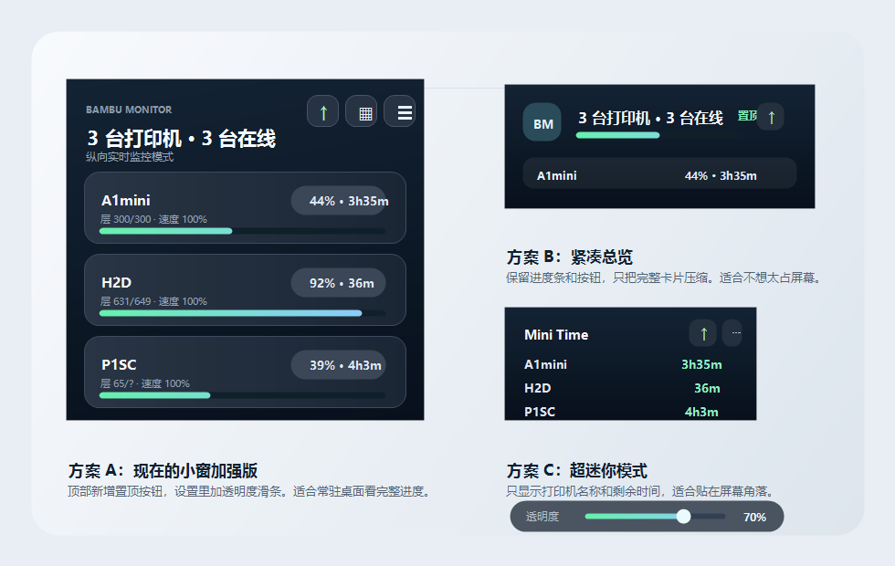

# BambuMonitor

BambuMonitor 是一款面向 Bambu Lab / 拓竹打印机的桌面悬浮监控工具。它会登录拓竹账号读取已绑定设备，在局域网内发现可连接的打印机，并通过本地 MQTT 显示实时打印进度、剩余时间、温度、AMS 和异常状态。

BambuMonitor is a desktop floating monitor for Bambu Lab printers. It signs in with a Bambu account, reads the bound printer list, discovers reachable printers on the LAN, and displays real-time print progress through local MQTT.




## Features

- 支持多台拓竹打印机同时监控
- 支持完整模式、紧凑模式和超迷你模式
- 支持窗口置顶、鼠标穿透锁定和透明度调节
- 支持账号密码登录和验证码登录
- 自动局域网扫描，扫不到时可手动设置 IP
- 实时显示进度、剩余时间、层数、温度、风扇、速度和 AMS 信息
- 支持 Windows 托盘菜单
- 支持 OpenClaw、Hermes 或其他 Webhook 自动化通知
- Multi-printer desktop overlay for Bambu Lab devices
- Full, compact, and mini window modes
- Always-on-top mode, click-through lock, and opacity control
- Password and verification-code login
- LAN discovery with manual IP fallback
- Real-time progress, remaining time, layer, temperature, fan, speed, and AMS display
- Windows tray menu for show/hide, lock, layout, opacity, and quit
- Webhook notifications for OpenClaw, Hermes, or other automation tools

## 中文说明

这个项目主要解决桌面端“随时看打印进度”的问题。它不是一个完整切片软件，也不会替代 Bambu Studio；它更像一个常驻桌面的轻量监控面板，适合多台机器同时打印时快速查看状态。

打包后的 Windows 安装包会在 GitHub Release 中提供，源码仓库不会提交 `release/`、`dist/`、`node_modules/` 或本地调试文件。

## Tech Stack

- Electron 40
- React 19
- Vite 7
- MQTT over TLS
- Bambu Cloud API and LAN SSDP discovery

## Development

```bash
npm install
npm run electron:dev
```

## Build

```bash
npm run build
npm run electron:build
```

The packaged Windows installer is generated in `release/`. Build outputs are intentionally not committed.

## Versioning

后续每次功能或打包更新都递增一个小版号，按 npm/electron-builder 兼容的语义化版本执行：`1.0.1` -> `1.0.2` -> `1.0.3`。

## Common Shortcuts

- `Ctrl + Shift + L`: lock or unlock click-through mode
- `Ctrl + Shift + H`: switch horizontal or vertical layout

## Project Structure

```text
electron/
  main.cjs        Electron main process
  preload.cjs     Renderer bridge
src/
  App.jsx         Login flow and page switching
  components/
    PrinterWidget.jsx
    MobileDashboard.jsx
  services/
    bambu.js      Printer state and MQTT parsing
    electron.js   Electron API wrapper
    notifications.js
docs/
  ai-webhook-connector.md
  notification-integrations.md
tools/
  generate-icon.ps1
```

## Notes

- Real-time LAN status requires the computer and printer to be on the same local network.
- The app stores session/configuration data locally through Electron and browser storage.
- Webhook targets and HMAC secrets are user-provided at runtime. Do not commit real secrets.

## License

MIT
