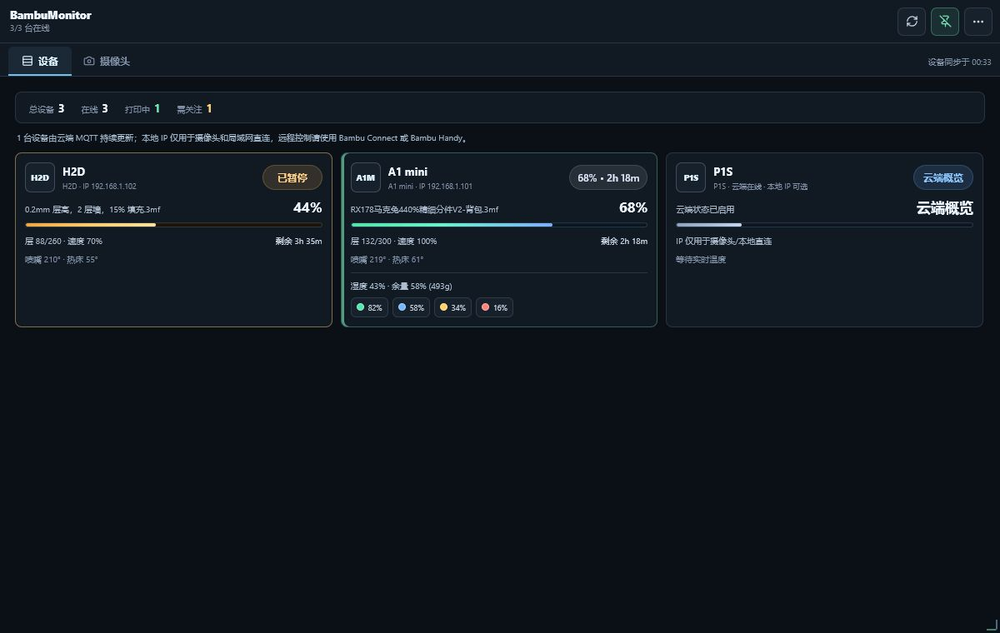
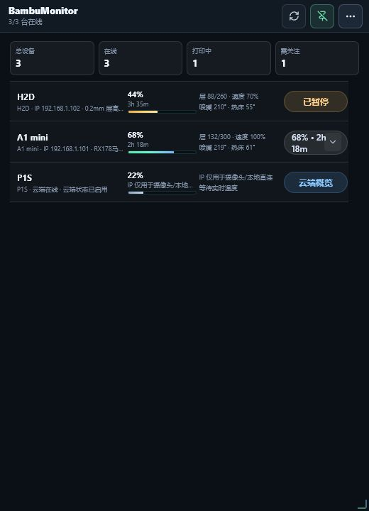
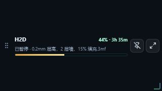
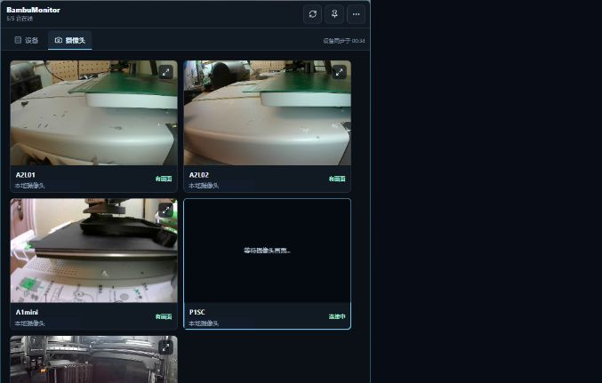
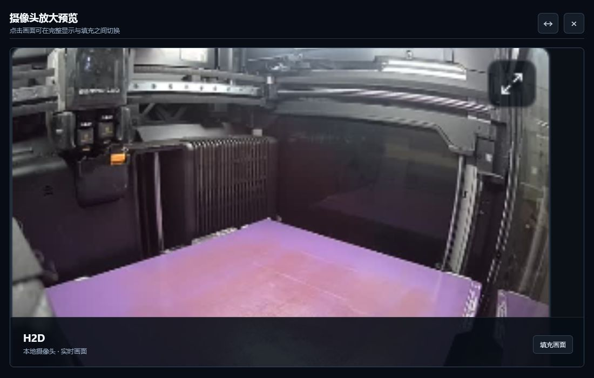
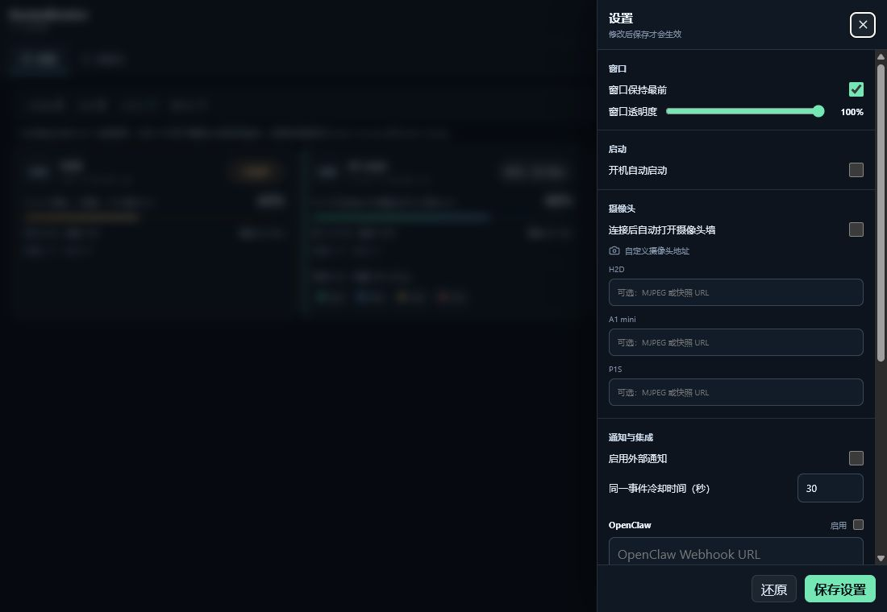

# BambuMonitor

> 把多台拓竹打印机的进度、温度、耗材与摄像头，集中到一个可以自由缩放的桌面工作区。



BambuMonitor 是一款面向 Bambu Lab / 拓竹打印机的轻量桌面监控工具。它适合同时管理多台设备的工作室、创客空间和个人用户：不用反复切换窗口，就能快速判断哪台正在打印、哪台需要关注，以及每个任务还要多久完成。

[下载最新版本](https://github.com/wuji419-bit/BambuMonitor/releases) · [查看源码](https://github.com/wuji419-bit/BambuMonitor) · AGPLv3 开源

## 为什么使用 BambuMonitor

- **一屏查看多台设备**：集中显示进度、剩余时间、层数、温度、速度、任务和 AMS 耗材。
- **窗口真正自由缩放**：完整、紧凑、迷你和摄像头放大模式分别记忆大小与位置。
- **摄像头墙**：同时查看多台打印机，点击画面即可放大，并支持填充或完整显示。
- **云端状态与本地画面结合**：状态可通过云端 MQTT 同步；摄像头与低延迟连接走局域网或 VPN。
- **为长期运行设计**：连接状态和打印状态分开显示，支持有限重试、异常提醒与会话恢复。
- **保持在手边**：窗口置顶、鼠标穿透锁定、透明度、开机启动和托盘控制。

## 界面一览

### 完整工作区

适合同时比较多台设备。需要关注和正在工作的设备会优先排列，云端设备不再强制要求填写本地 IP。


### 紧凑与迷你模式

紧凑模式保留关键状态，适合放在屏幕侧边；迷你模式只显示当前最重要的任务，可作为桌面常驻进度条。

| 紧凑模式 | 迷你模式 |
| --- | --- |
|  |  |

### 摄像头墙与放大预览

H2D、X1、P2S 等机型优先通过本机转换 RTSPS；A1、A1 mini、P1、A2 系列尝试设备的本地 JPEG 摄像头协议。也可以为单台设备填写自定义 MJPEG 或快照地址。

| 摄像头墙 | 放大预览 |
| --- | --- |
|  |  |

### 设置

设置面板集中管理窗口、开机启动、摄像头和通知集成；修改内容只有保存后才会生效。



## 下载安装

Windows 与 macOS 安装包通过 GitHub Releases 提供：

**[前往 Releases 下载](https://github.com/wuji419-bit/BambuMonitor/releases)**

- Windows：下载 `.exe` 安装包。
- macOS：下载 `.dmg` 安装包。首次发布的未签名版本可能需要在系统设置中确认打开。
- 仓库不会提交 `node_modules/`、`dist/` 或本地调试文件。

## 连接方式

### 云端状态

登录 Bambu Lab / MakerWorld 账号后，BambuMonitor 可以同步账号下已绑定的设备，并通过拓竹云端 MQTT 获取在线状态、打印进度、温度、AMS 和层数等信息。因此，只查看状态时不要求每台设备都填写本地 IP。

云端数据可能受网络质量、服务限流或同步延迟影响。应用会保留最后一次有效数据，并单独显示“连接中、重连中、离线”等连接状态，避免把短暂重连误报成打印任务异常。

### 局域网、VPN 与摄像头

摄像头、本地 MQTT 和低延迟更新需要运行 BambuMonitor 的电脑能直接访问打印机所在网络。应用会尝试扫描局域网；在外网使用时，可以先通过 Tailscale、ZeroTier、WireGuard 或路由器 VPN 返回设备所在网络，再填写隧道内可访问的打印机 IP。

**本项目不会自动穿透公网，也不建议把打印机 MQTT 或摄像头端口直接映射到互联网。** 如果需要官方远程控制，请使用 Bambu Connect、Bambu Studio 或 Bambu Handy。

## 摄像头稳定性

- 自动摄像头采用受限并发启动，避免多台设备同时抢占连接。
- 启动失败后执行有限次数、带退避的重试，不会无限重连。
- 单台设备可以手动重试，也可以使用外部 MJPEG / 快照 URL。
- 点击任意可用画面进入放大预览，支持完整显示和填充画面切换。
- 摄像头依赖局域网或 VPN；云端状态在线不代表本地摄像头一定可达。

## 通知与集成

BambuMonitor 可以在任务完成、设备断开和恢复连接时触发通知，并支持 OpenClaw、Hermes 或通用 Webhook 集成。相同事件带有冷却时间，避免连接抖动造成重复提醒。

## 隐私与安全

- 登录会话通过 Electron 系统安全存储加密保存，退出账号时会清除本地会话。
- 密码、验证码和访问令牌不会写入项目仓库。
- 本项目不会打包、读取或逆向提取 Bambu networking plugin 的私有数据。
- BambuMonitor 是非官方社区项目，与 Bambu Lab / 拓竹官方无隶属或背书关系。

## 快捷键

- `Ctrl + Shift + L`：锁定或解锁鼠标穿透。
- `Ctrl + Shift + H`：切换横向或纵向布局。

## 本地开发

```bash
npm install
npm run electron:dev
```

运行检查：

```bash
npm test
npm run lint
npm run build
```

生成安装包：

```bash
npm run electron:build
```

Windows 安装包需要在 Windows 构建；macOS DMG 需要在 macOS 或仓库配置的 GitHub Actions macOS runner 中构建。

## 技术栈

- Electron 40
- React 19
- Vite 7
- MQTT over TLS
- Bambu Cloud API
- 局域网 SSDP、RTSPS、JPEG 摄像头协议与 FFmpeg

## 开源协议

本项目使用 **GNU Affero General Public License v3.0 or later（AGPL-3.0-or-later）**，详情见 [LICENSE](./LICENSE)。修改后发布或通过网络提供修改版服务时，需要按照 AGPLv3 提供对应源代码。

## English

BambuMonitor is a responsive desktop workspace for monitoring multiple Bambu Lab printers. It combines cloud MQTT telemetry with LAN or VPN camera access, provides full, compact, mini, and camera views, and remembers each window mode independently. The project is unofficial and licensed under AGPL-3.0-or-later.
