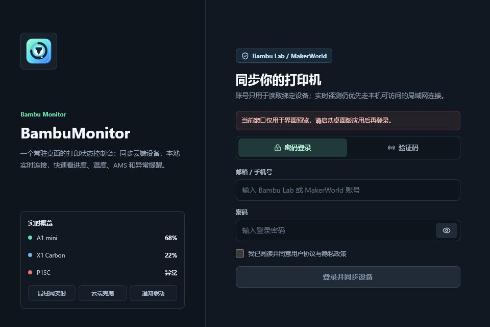

# BambuMonitor

BambuMonitor 是一款面向 Bambu Lab / 拓竹打印机的 Windows 与 macOS 桌面悬浮监控工具。它会同步账号下已绑定的设备，通过云端 MQTT 获取在线状态与打印遥测；在局域网或 VPN 可达时，也可以连接打印机本地 MQTT 与摄像头。

它不是切片软件，也不会替代 Bambu Studio；它更像一个常驻桌面的轻量监控面板，适合多台机器同时打印时快速查看状态。

## 截图




## 下载安装

Windows 与 macOS 安装包在 GitHub Release 中提供：

[前往 Releases 下载](https://github.com/wuji419-bit/BambuMonitor/releases)

源码仓库不会提交 `release/`、`dist/`、`node_modules/` 或本地调试文件。

## 功能

- 多台 Bambu Lab / 拓竹打印机同时监控
- 完整模式、紧凑模式和超迷你模式
- 窗口置顶、鼠标穿透锁定和透明度调节
- 账号密码登录和验证码登录
- 自动局域网扫描，扫不到时可手动设置 IP
- 手动刷新设备列表，并每 5 分钟自动同步一次账号下新增、移除或改名的设备
- 将打印任务状态与连接状态分开显示，重连时不再把“打印中”错误覆盖掉
- 实时显示进度、剩余时间、层数、温度、风扇、速度和 AMS 信息
- 局域网实时模式会按本地遥测时间继续倒计时，避免剩余时间长时间停留在旧值
- 摄像头墙：限制并发启动、失败自动退避重试，也可单独手动重试；支持为每台打印机填写自定义 MJPEG / 快照 URL
- 登录会话使用 Electron 系统安全存储加密保存，旧版明文会话会在读取后自动迁移
- Windows 托盘菜单：显示/隐藏、锁定、布局切换、透明度调节和退出
- OpenClaw、Hermes 或其他 Webhook 自动化通知

## 云端状态与本地连接

BambuMonitor 可以通过拓竹云端 MQTT 获取设备状态与打印遥测，因此只查看进度、温度、AMS、层数等信息时，不要求每台设备都填写本地 IP。云端数据可能受网络质量、服务限流或同步延迟影响；应用会保留最后一次有效数据，并独立显示“连接中、重连中、离线”等连接状态。

本地 IP 仍有明确用途：摄像头、本地 MQTT 直连以及局域网低延迟更新都需要电脑能够访问打印机所在网络。应用会自动扫描局域网，也允许为 VPN 场景手动填写可达 IP。

本项目是非官方社区工具，不提供拓竹官方 App 的远程控制能力。登录仅用于用户主动发起的设备同步与云端 MQTT 连接；如需官方远程视图或控制，请使用 Bambu Connect、Bambu Studio 或 Bambu Handy。

本项目不会打包、读取或逆向提取 Bambu networking plugin 的私有数据。

## 关于外网连接

状态与打印遥测可以走云端 MQTT，不需要暴露家里或工作室的打印机端口。摄像头与本地直连不会自动穿透公网；人在外面时，需要先通过 Tailscale、ZeroTier、WireGuard 或路由器 VPN 连回打印机所在网络，再填写隧道内可访问的打印机 IP。

不要把打印机的 MQTT 或摄像头端口直接映射到公网。云端 MQTT 的可用性依赖拓竹服务，未来接口变化时也可能需要适配。

## 摄像头说明

摄像头功能已经加入桌面版界面。点击面板上的摄像头按钮可以打开“摄像头墙”；在设置中也可以开启“连接后自动打开摄像头墙”。

自动摄像头模式依赖局域网或 VPN。H2D / X1 / P2S 等机型会优先通过本机 `ffmpeg` 将 RTSPS 画面转换为浏览器可显示的 MJPEG；A1 / A1 mini / P1 / A2 系列会尝试本地 `6000` 端口 JPEG 摄像头协议，并在界面中用快照帧刷新。应用一次最多启动两路摄像头，失败后会有限次退避重试，避免五台设备同时抢占连接导致整面画面反复重连；也可以对单台设备手动重试。

## 快捷键

- `Ctrl + Shift + L`：锁定/解锁鼠标穿透
- `Ctrl + Shift + H`：切换横向/纵向布局

## 技术栈

- Electron 40
- React 19
- Vite 7
- MQTT over TLS
- Bambu Cloud API + 局域网 SSDP 扫描

## 开发

```bash
npm install
npm run electron:dev
```

## 打包

```bash
npm run build
npm run electron:build
```

打包后的安装包会输出到 `release/`。macOS 安装包必须在 macOS 环境或对应的 GitHub Actions runner 中构建。

## 版本规则

后续只有应用代码、图标或安装包内容发生实际变化时，才递增一个小版号并重新打包，例如：`1.0.6` -> `1.0.7`。

## English

BambuMonitor is a Windows and macOS floating monitor for Bambu Lab printers. It synchronizes bound devices and telemetry through cloud MQTT, while LAN or VPN connectivity enables local MQTT and camera previews.

## License

GNU Affero General Public License v3.0 or later (AGPL-3.0-or-later). See [LICENSE](./LICENSE).
