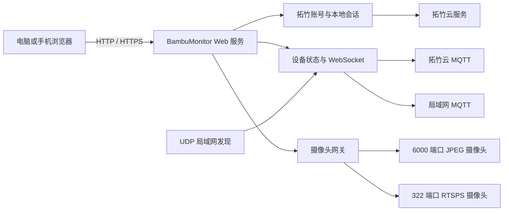

# BambuMonitor NAS Docker 版设计

日期：2026-07-18  
状态：已确认，待实施计划

## 1. 目标

将 BambuMonitor 作为一个完整的 Docker 服务部署在 Linux NAS 上。容器在打印机所在局域网内常驻运行，统一负责拓竹账号登录、设备同步、MQTT 状态连接、局域网发现和摄像头转流；电脑或手机只通过浏览器访问 NAS，不再直接连接打印机。

首版成功标准：

- 用户只需部署一个 `bambu-monitor` 容器。
- 浏览器通过 `http://NAS-IP:3080` 或用户自行配置的 HTTPS 域名访问。
- 用户只使用拓竹账号登录，不新增本地账号或备用入口。
- 容器重启、升级后保留登录、设备缓存和设置。
- 当前五台打印机可以同时显示实时状态和摄像头画面。
- 多个浏览器观看时，每台打印机仍只保留一个上游摄像头连接。
- 发布 `linux/amd64` 与 `linux/arm64` 镜像。

## 2. 已确认决策

1. BambuMonitor 本身就是 Docker 中运行的完整产品，不是在桌面 EXE 外增加代理层。
2. 核心交付物只有一个 BambuMonitor 镜像；Cloudflare Tunnel、Caddy、Nginx Proxy Manager 等均为用户可选的外部设施。
3. 首版唯一登录方式是拓竹账号；不提供本地管理员、游客、只读账号、Cloudflare Access 登录或恢复入口。
4. NAS 后端访问局域网打印机，外网浏览器只访问 NAS。
5. 首版保持监控工具定位，不增加打印控制、文件上传或切片功能。

## 3. 非目标

- 不把 MQTT、6000、322、FTP 等打印机端口暴露到公网。
- 不在项目内自动申请域名、证书或修改路由器端口映射。
- 不管理 Cloudflare、反向代理或 NAS 系统账号。
- 不提供多人、角色、权限组或共享链接。
- 不实现 Kubernetes、集群或多实例高可用。
- 不要求导入桌面版 localStorage；NAS 首次部署重新登录并自动重建设备缓存。

## 4. 总体架构



容器内部由四个清晰边界组成：

- **Web/API 服务**：提供 React 静态资源、REST API、WebSocket、健康检查和摄像头同源地址。
- **认证与持久化**：完成拓竹登录、会话管理、令牌保存、配置与设备缓存的原子写入。
- **设备运行时**：维护每台设备的一条 MQTT 连接，合并云端设备与局域网扫描结果，并向浏览器广播标准化状态。
- **摄像头运行时**：维护每台设备的唯一上游视频源，缓存最新帧并向所有浏览器复用。

现有 Electron 版继续保留。设备解析、MQTT 配置、摄像头协议和状态标准化逻辑提取为共享核心；桌面版通过 Electron IPC 适配，NAS 版通过 HTTP/WebSocket 适配，避免维护两套协议实现。

## 5. Docker 运行模型

镜像名称：

```text
ghcr.io/wuji419-bit/bambu-monitor:latest
```

推荐 Compose：

```yaml
services:
  bambu-monitor:
    image: ghcr.io/wuji419-bit/bambu-monitor:latest
    container_name: bambu-monitor
    network_mode: host
    restart: unless-stopped
    volumes:
      - ./data:/app/data
    environment:
      PORT: 3080
      TZ: Asia/Shanghai
```

使用 `network_mode: host` 的原因是 NAS 版需要直接访问局域网 TCP/UDP，并接收打印机发现广播。该模式仅作为 Linux NAS 的正式支持路径；桥接网络可作为手动 IP 模式的后续兼容项，不作为首版验收环境。

容器内包含：

- Node.js LTS 运行时。
- 构建后的 React Web 界面。
- FFmpeg，用于 H2D/X1/P2S 等 RTSPS 视频源转码。
- `tini` 或等效 init，用于正确转发退出信号并回收 FFmpeg 子进程。

服务默认监听 `0.0.0.0:3080`。反向代理只需转发 HTTP 和 WebSocket；HTTPS 在反向代理处终止，不由 BambuMonitor 自动配置。

## 6. 登录与会话

### 6.1 唯一登录入口

登录页支持现有桌面版已经使用的拓竹账号流程：

- 国内手机号/邮箱与密码登录。
- 短信或邮箱验证码登录。
- 异常登录需要验证码时切换到验证步骤。

浏览器把凭据提交给 NAS 后端；后端调用拓竹服务完成验证。密码与验证码只在当前请求内存中存在，不写入文件、不进入日志。成功后只保存拓竹访问令牌和必要账号标识。

这不是官方的“使用拓竹登录”OAuth 跳转。当前没有公开的第三方 Bambu OAuth 身份提供方接口，因此 NAS 版沿用桌面版的自托管登录逻辑。拓竹云接口变化可能导致登录暂时失效；根据已确认范围，首版不提供第二登录入口。

### 6.2 Web 会话

- 登录成功后生成高熵随机会话 ID。
- 浏览器只保存 `HttpOnly`、`SameSite=Lax` Cookie。
- 配置 HTTPS 公网地址时使用 `Secure` Cookie。
- 服务端会话默认有效期 30 天，活跃使用时滚动续期。
- 退出登录同时撤销本地会话并删除已保存拓竹令牌。
- 登录、验证码和设备同步接口实施请求频率限制。
- 所有状态、设置和摄像头 API 均验证服务端会话。

### 6.3 持久化

`/app/data` 使用少量版本化文件，不引入数据库或原生数据库依赖：

```text
/app/data/
  config.json
  device-cache.json
  session.enc
  secret.key
```

- 首次启动自动生成 `secret.key`，权限设为仅容器用户可读。
- `session.enc` 使用 AES-256-GCM 保存拓竹令牌和账号标识。
- JSON 配置采用临时文件、刷新和原子替换，避免断电产生半写文件。
- 日志输出到 stdout/stderr，由 NAS Docker 管理；日志必须隐藏密码、令牌、访问码和带凭据的摄像头 URL。
- 数据卷与密钥位于同一 NAS 时无法抵御 NAS 管理员或主机完全失陷；该设计保护的是意外读取、日志泄漏和普通文件暴露，不宣称抵御宿主机控制者。

## 7. 设备发现与状态数据流

1. 登录成功后从拓竹云获取该账号绑定设备，立即显示完整设备数量。
2. 后端为每台设备建立云 MQTT 状态连接，不要求先填写局域网 IP。
3. 后台执行 UDP 局域网扫描，并通过序列号、云端 ID 和规范化设备名合并本地地址。
4. 扫描成功后更新 IP 缓存；扫描失败时保留上次已验证地址。
5. 摄像头或本地连接缺少 IP 时允许用户在设置中手动填写，但不会影响云端状态展示。
6. 后端把设备状态标准化后通过单一 WebSocket 广播给所有已登录浏览器。
7. 新浏览器连接先获得完整快照，再接收增量更新。

每台打印机只允许一个活动 MQTT 连接任务。重连由后端统一管理，浏览器刷新或新增浏览器不会产生新的打印机连接。

## 8. 摄像头设计

摄像头网关按打印机序列号维护唯一源：

- A1、A1 mini、P1、A2 等 6000 端口 JPEG 源复用现有 `ChamberImageStream` 解析逻辑。
- H2D、X1、P2S 等 RTSPS 源由一个常驻 FFmpeg 子进程转成 JPEG 帧。
- 上游源产生的最新帧保存在内存中，由所有浏览器客户端共享。
- 浏览器绝不获得包含打印机 IP、访问码或 RTSPS 凭据的真实源地址。

传输策略：

- 摄像头墙请求缓存快照，目标 1-2 FPS。
- 点击放大后使用共享 MJPEG 流，目标 4 FPS。
- 无浏览器观看某台摄像头 30 秒后释放该上游源。
- 放大、缩小、刷新页面或同时打开多个浏览器都不得增加上游源数量。
- FFmpeg 异常退出使用有上限的指数退避重启，不得形成进程风暴。
- 容器收到 `SIGTERM` 时停止接受请求，关闭 MQTT、摄像头源、WebSocket 和 FFmpeg 后退出。

## 9. Web 界面

NAS 版复用现有 BambuMonitor 的视觉语言和核心视图：

- 拓竹账号登录。
- 设备总数、在线数、打印中和需关注摘要。
- 完整设备卡片和响应式紧凑布局。
- 摄像头墙、点击放大、适应/填充切换。
- 设备 IP、摄像头与通知设置。
- 设备同步与手动刷新反馈。

NAS Web 环境隐藏桌面专属功能：

- 窗口置顶、鼠标穿透、透明度、窗口锁定。
- 原生窗口最小化、关闭和尺寸模式。
- Windows/macOS 开机启动设置。

页面在桌面、平板和手机浏览器中响应式布局。PWA 安装、离线缓存和推送通知不在首版范围。

## 10. API 边界

建议的外部接口：

```text
POST   /api/auth/login
POST   /api/auth/code/request
POST   /api/auth/code/verify
POST   /api/auth/logout
GET    /api/session
GET    /api/devices
POST   /api/devices/refresh
PATCH  /api/devices/:id
GET    /api/settings
PUT    /api/settings
GET    /api/cameras/:id/frame
GET    /api/cameras/:id/stream
GET    /api/ws
GET    /healthz
GET    /readyz
```

约束：

- `/healthz` 只表示进程存活，不泄露设备、账号和网络信息。
- `/readyz` 表示配置与持久化目录可用，不要求所有打印机在线。
- 除健康检查与静态登录页外，所有接口必须有有效会话。
- 修改状态的请求验证 Origin、Content-Type 和 CSRF 令牌。
- WebSocket 建立时验证同源 Cookie，并限制每个会话的连接数量。

## 11. 错误处理与可观测性

- **拓竹登录失败**：显示拓竹返回的可理解错误；不记录输入凭据。
- **令牌失效**：停止云连接、清除服务端会话并返回唯一登录页。
- **云端不可用**：保留最后状态并标记云端重连，不删除设备列表。
- **局域网扫描失败**：继续使用缓存 IP；允许手动更新地址。
- **单台 MQTT 失败**：只影响该设备，采用既有重连宽限期。
- **单台摄像头失败**：卡片显示具体阶段和可重试状态，不阻塞其他摄像头。
- **存储损坏**：拒绝使用无法认证的数据文件，记录不含秘密的结构化错误并进入未登录状态。
- **资源保护**：限制请求体、登录频率、摄像头客户端和 FFmpeg 重启频率。

日志采用结构化单行输出，至少包含时间、级别、组件、设备匿名标识和错误阶段。默认不输出完整 IP；调试模式可输出局域网地址，但始终隐藏访问码和令牌。

## 12. 构建、发布与升级

- 使用多阶段 Dockerfile 构建前端与服务器运行层。
- GitHub Actions 在版本标签上构建 `linux/amd64`、`linux/arm64` 清单并推送 GHCR。
- 发布 `latest`、`1.1` 和完整版本号标签。
- 镜像构建必须固定基础镜像主版本并生成依赖清单。
- 容器以非 root 用户运行；仅网络发现所需能力按最小范围开放。
- 应用启动时执行版本化数据迁移；迁移先备份旧文件并可重复运行。
- 升级流程为拉取新镜像并重建容器，`/app/data` 保持不变。

## 13. 测试策略

### 13.1 单元测试

- 认证会话创建、续期、撤销和加密持久化。
- 云设备、扫描设备与缓存 IP 合并。
- 每设备 MQTT 单例和重连状态机。
- 每摄像头源单例、引用计数、空闲释放和重启退避。
- API 输入验证、秘密脱敏和代理协议判断。

### 13.2 集成测试

- 使用模拟拓竹服务完成密码、验证码、令牌失效和退出流程。
- 两个浏览器客户端订阅同一设备时只创建一个 MQTT 任务。
- 两个浏览器同时观看 H2D 时只创建一个 FFmpeg 进程。
- 容器收到退出信号后不遗留 FFmpeg 子进程。
- 数据目录重启、升级和损坏恢复测试。

### 13.3 浏览器与 Docker 测试

- Playwright 覆盖登录、设备列表、摄像头墙、放大、设置和手机布局。
- Docker Compose 冒烟测试验证 `/healthz`、WebSocket、数据卷和重启。
- CI 构建并启动 amd64 镜像；arm64 至少完成镜像构建与静态运行检查。
- 发布前使用当前五台真实打印机执行长时间并发测试。

## 14. 验收标准

1. 一条 Compose 配置可在通用 Linux Docker NAS 启动服务。
2. 未登录访问任何设备或摄像头接口均被拒绝。
3. 拓竹登录后显示账号绑定的全部设备，不因缺少 IP 减少设备数量。
4. 当前五台打印机的云状态可同时更新。
5. NAS 局域网可达时五台摄像头均可显示；浏览器位于外网时不需要访问打印机私网地址。
6. 同时打开两个浏览器不会增加每台打印机的 MQTT 或上游摄像头连接数。
7. H2D 不会因刷新、放大或错误重试产生多个残留 FFmpeg。
8. 容器重启后自动恢复保存的拓竹会话、设备缓存和设置。
9. 删除数据卷后回到唯一拓竹登录页，不出现其他认证入口。
10. amd64 与 arm64 镜像均发布到 GHCR，并包含可用健康检查。

## 15. 风险与边界

- 拓竹未公开第三方登录 OAuth；NAS 版依赖现有桌面版使用的云登录接口，接口变化会影响登录和云状态。
- 部分新固件可能要求 Bambu Connect 或开发者模式；本项目不能承诺绕过厂商授权策略。
- Docker host 网络是 Linux NAS 的明确前提；不同 NAS 的防火墙仍可能阻止 UDP 发现或打印机端口。
- 外网视频质量取决于 NAS 上行带宽和用户反向代理；首版通过低帧率墙面与按需放大控制带宽。
- BambuMonitor 只保护自身 Web/API，不能修复打印机局域网本身的安全配置。

## 16. 外部参考

- Docker host 网络模式：<https://docs.docker.com/engine/network/drivers/host/>
- Cloudflare 自托管应用与 Tunnel（可选外部部署）：<https://developers.cloudflare.com/cloudflare-one/access-controls/applications/http-apps/self-hosted-public-app/>
- 拓竹第三方集成说明：<https://blog.bambulab.com/updates-and-third-party-integration-with-bambu-connect/>

